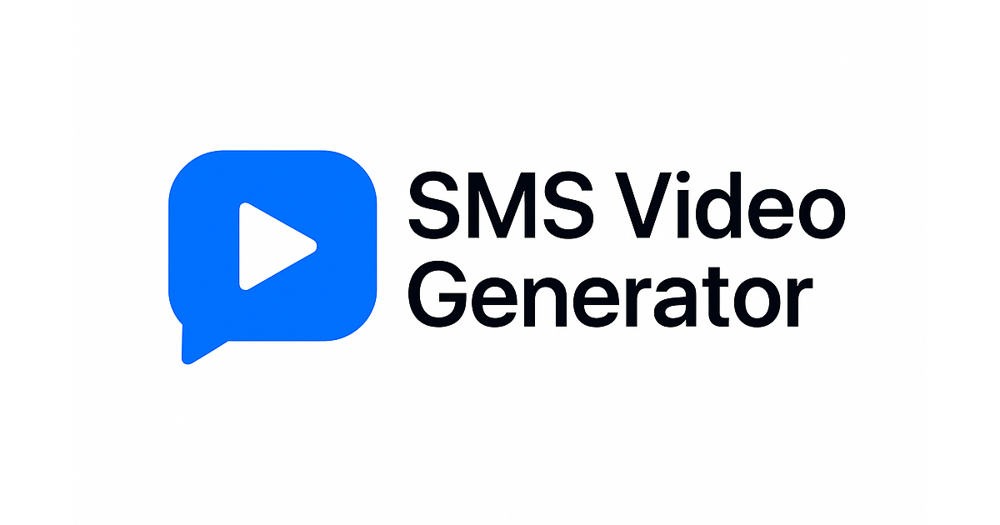

# Générateur de Vidéos iMessages pour TikTok

<p align="center">
  
</p>

Ce projet permet de générer automatiquement des vidéos d'échanges iMessages stylisées et animées, parfaites pour TikTok et autres réseaux sociaux. Basé sur [Remotion](https://www.remotion.dev/), il transforme des conversations JSON en vidéos engageantes avec animations de frappe, bulles de messages et audio synthétisé.

## ✨ Fonctionnalités

- ✅**Interface iMessage authentique** : Reproduction fidèle de l'interface iOS
- ✅**Animations fluides** : Apparition progressive des messages avec effet de frappe
- ⏳**Audio synthétisé** : Génération automatique de voix-off avec Google TTS
- ✅**Personnalisation** : Thèmes sombre/clair, genres de voix, profils utilisateur
- ✅**Format TikTok** : Optimisé pour les réseaux sociaux (1080x1920)
- ✅**Conversations JSON** : Configuration simple via fichiers JSON

## 🚀 Démarrage rapide

### Prérequis

1. **Installer Node.js**  
  Téléchargez et installez la version 18 ou supérieure depuis [nodejs.org](https://nodejs.org/).

1. **Installer Git**  
  Téléchargez et installez Git depuis [git-scm.com](https://git-scm.com/).

1. **Cloner le dépôt et installer les dépendances**  
  Suivez les instructions ci-dessous pour cloner le projet et installer les dépendances nécessaires.

### Installation

1. **Cloner le projet**
```console
git clone [lien du repository]
cd i-messages-videos
```

2. **Installer les dépendances Node.js**
```console
npm install
```

<!-- 3. **Installer les dépendances Python pour l'audio**
```console
pip install gtts pydub
``` -->

### Configuration d'une conversation

1. **Créer votre conversation**
   
   Créez un fichier JSON dans `public/conversations/` :
   ```json
   {
     "botName": "Tom",
     "gender": "male",
     "hook": "POV : Il m'a dit que c'était juste une collègue…",
     "CTA": "Je fais quoi ?\nAidez moi !",
     "messages": [
       {
         "sender": "user",
         "text": "C'est qui Jennifer ?"
       },
       {
         "sender": "bot", 
         "text": "Tu parles de Jenny ? Ma collègue ?"
       }
     ]
   }
   ```

2. **Modifier le fichier source**
   
   Dans `src/Sms.tsx`, mettez à jour l'import de conversation :
   ```tsx
   import conversation from "../public/conversations/votre-conversation.json";
   ```

## 🎬 Utilisation

### Prévisualisation

Lancez le studio Remotion pour prévisualiser votre vidéo :
```console
npm run dev
```
Ouvrez http://localhost:3000 dans votre navigateur.

### Rendu de la vidéo

Pour générer la vidéo finale :
```console
npx remotion render Sms out/video.mp4
```

## ⚙️ Configuration avancée

### Personnalisation visuelle

Dans `src/Sms.tsx`, modifiez :
- `darkTheme = true/false` : Thème sombre ou clair
- `showTypingInputBar = true/false` : Afficher la barre de saisie
- `enableAudioGeneration = true/false` : Activer l'audio automatique

### Durée et timing

Ajustez les paramètres de timing :
- `messageDuration = 60` : Durée d'affichage par message (en frames)
- `initialDelay = 120` : Délai avant le premier message
- `typingIndicatorDuration = 30` : Durée de l'indicateur de frappe

## 📁 Structure du projet

```
├── public/
│   ├── conversations/          # Fichiers JSON des conversations
│   ├── audio/                  # Fichiers audio générés
│   ├── images/                 # Assets visuels (bulles, icônes)
│   └── sfx/                    # Effets sonores
├── src/
│   ├── components/             # Composants React
│   │   ├── background.tsx      # Interface iMessage
│   │   ├── bubble.tsx          # Bulles de messages
│   │   └── TypingIndicator.tsx # Animation de frappe
│   ├── Root.tsx                # Configuration des compositions
│   └── Sms.tsx                 # Composant principal
└── scripts/
    ├── generate-voiceoff.js    # Génération audio Node.js
    └── generate_single_audio.py # Script Python TTS
```

<!-- ## 🛠️ Dépannage

### Problèmes audio
- Vérifiez que Python et les modules `gtts` et `pydub` sont installés
- Sur Windows, assurez-vous que `ffmpeg` est dans votre PATH
- Relancez `npm run gen-audio` après modification des conversations

### Problèmes de rendu
- Vérifiez que tous les fichiers audio sont générés dans `public/audio/`
- Augmentez la mémoire allouée : `npx remotion render --memory=4096`
- Utilisez `--log=verbose` pour plus de détails sur les erreurs

### Performance
- Ajustez `Config.setConcurrency()` dans `remotion.config.ts`
- Utilisez le format JPEG pour un rendu plus rapide
- Réduisez la qualité JPEG si nécessaire -->

## 📋 Commandes utiles

| Commande                                   | Description                          |
| ------------------------------------------ | ------------------------------------ |
| `npm run dev`                              | Lancer le studio de prévisualisation |
| `npx remotion upgrade`                     | Mettre à jour Remotion               |
| `npx remotion render Sms out/ma-video.mp4` | Rendre une vidéo                     |
| <!--                                       | `npm run gen-audio`                  | Générer les fichiers audio |
| `npm run lint`                             | Vérifier le code                     | -->                        |

## 🎯 Conseils pour TikTok

1. **Hooks percutants** : Utilisez des accroches qui créent de l'engagement
2. **Rythme rapide** : Gardez les messages courts et rythmés  
3. **CTA efficaces** : Terminez par une question pour encourager les commentaires
4. **Émotions fortes** : Jalousie, surprise, humour fonctionnent bien
5. **Durée optimale** : 15-30 secondes pour un engagement maximal

## 📚 Ressources

### Documentation
- [Remotion Fundamentals](https://www.remotion.dev/docs/the-fundamentals) - Apprendre les bases de Remotion
- [Remotion API](https://www.remotion.dev/docs/api) - Référence de l'API
- [React Documentation](https://react.dev/) - Guide React

### Support
- [Discord Remotion](https://discord.gg/6VzzNDwUwV) - Communauté d'aide
- [GitHub Issues](https://github.com/remotion-dev/remotion/issues/new) - Signaler un problème

### Technologies utilisées
- **Remotion** - Framework de génération vidéo
- **React** - Interface utilisateur
- **TypeScript** - Typage statique
- **Tailwind CSS** - Styles
- **Google TTS** - Synthèse vocale
- **Python** - Scripts audio

## 📄 Licence

Ce projet peut nécessiter une licence commerciale pour certains cas d'usage. [Consulter les conditions](https://github.com/remotion-dev/remotion/blob/main/LICENSE.md).

---

## 🌐 Interface Web

Une interface web intuitive est maintenant disponible pour faciliter la création de vidéos ! 

### Lancement rapide de l'interface
```console
npm install express cors
npm run interface
```
Puis ouvrez [http://localhost:3001/interface.html](http://localhost:3001/interface.html)

### Fonctionnalités de l'interface
- ✅ **Création visuelle** de conversations avec prévisualisation temps réel
- ✅ **Templates prédéfinis** pour différents scénarios (jalousie, mensonge, trahison)
- ✅ **Configuration avancée** des paramètres vidéo via interface
- ✅ **Actions automatisées** : sauvegarde, génération audio, rendu vidéo
- ✅ **Générateur IA** pour créer des conversations automatiquement

👉 **Consultez [INTERFACE.md](./INTERFACE.md) pour le guide complet de l'interface web**

---

**Créé avec ❤️ par [Julien Noel](https://github.com/juliennoel22)**

